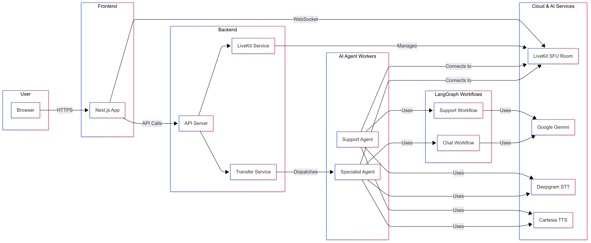
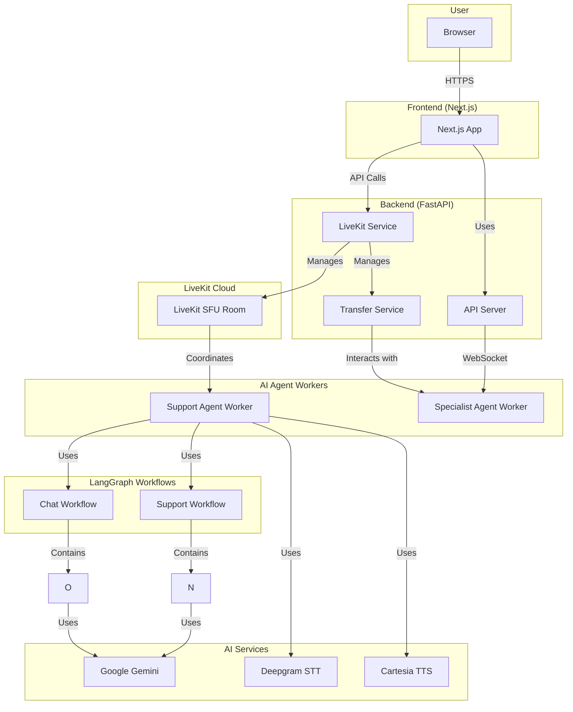

# Calby - A Voice Agent Application

Calby is a sophisticated voice agent application designed to provide a seamless and intelligent customer support experience. It leverages a powerful stack of technologies, including LiveKit for real-time communication, LangChain and Google Gemini for advanced AI capabilities, and a modern Next.js frontend for an intuitive user interface.

## System Architecture

Mermaid Diagram

This repository is organized into two main parts:

- `api/`: A Python-based backend powered by FastAPI that manages real-time communication, AI agent logic, and call handling.
- `web/`: A Next.js-based frontend application that provides the user interface for interacting with the voice agent.

## Key Features

- **Real-time Audio/Video Communication**: Built on top of LiveKit, Calby provides robust and low-latency audio and video call capabilities.
- **AI-Powered Agents**: Utilizes LangChain and Google Gemini to create intelligent support and specialist agents that can understand context and handle complex conversations.
- **Warm Transfers**: Seamlessly transfer calls from a general support agent to a specialist with full context, ensuring a smooth customer experience.
- **Speech-to-Text and Text-to-Speech**: Integrates with Deepgram for accurate real-time transcription and Cartesia for natural-sounding text-to-speech.
- **Modern Frontend**: A responsive and customizable user interface built with Next.js, React, and Tailwind CSS.
- **Scalable Architecture**: The backend is built with FastAPI, providing a high-performance and scalable foundation for the application.

## Getting Started

For a complete guide on setting up the development environment, please see the [Setup Guide](docs/setup.md).

To learn more about the architecture of the application, please refer to the following documents:

- **Overall Architecture**: [Architecture Overview](docs/architecture.md)
- **Backend Details**: [API Documentation](docs/api_documentation.md)
- **Frontend Details**: [Web Documentation](docs/web_documentation.md)

## Technologies Used

- **Backend**: Python, FastAPI, LiveKit Agents, LangChain, Google Gemini, Deepgram, Cartesia
- **Frontend**: Next.js, React, TypeScript, LiveKit Components, Tailwind CSS, shadcn/ui
- **Real-time Communication**: LiveKit

## License

This project is licensed under the GNU General Public License v3.0. See the [LICENSE](LICENSE) file for more details.
