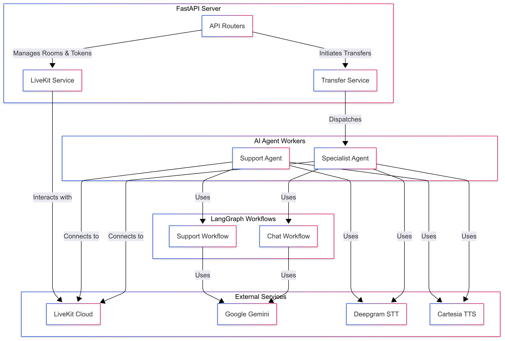

# API Documentation

This document provides an overview of the backend API for the Calby application.

## Table of Contents

- [Project Structure](#project-structure)
- [Technologies Used](#technologies-used)
- [API Architecture](#api-architecture)
- [API Endpoints](#api-endpoints)
- [Services](#services)
- [AI Agents](#ai-agents)

## Project Structure

The backend code is located in the `/api` directory. Here is a breakdown of the key folders:

- `/api/app`: The main FastAPI application.
- `/api/app/routers`: Defines the API endpoints.
- `/api/app/services`: Contains the business logic for interacting with external services like LiveKit.
- `/api/agents`: Contains the AI agent logic, including the `langgraph` workflows.

## Technologies Used

- **Framework**: [FastAPI](https://fastapi.tiangolo.com/)
- **Language**: [Python](https://www.python.org/)
- **Real-time Communication**: [LiveKit Agents](https://docs.livekit.io/agents/)
- **AI Orchestration**: [LangChain](https://www.langchain.com/) (with `langgraph`)
- **AI Models**: [Google Gemini](https://deepmind.google/technologies/gemini/)
- **Speech-to-Text**: [Deepgram](https://deepgram.com/)
- **Text-to-Speech**: [Cartesia](https://www.cartesia.ai/)

## API Architecture

The API is built with FastAPI and is responsible for managing the real-time communication, AI agent logic, and call handling. It exposes a set of endpoints for the frontend to interact with and utilizes services to communicate with LiveKit and other external services.

## API Endpoints

The primary API endpoints are defined in `/api/app/routers/call.py`. These endpoints are used to create and manage calls.

## Services

- **`LiveKitService`**: Manages the creation of LiveKit rooms and access tokens.
- **`TransferService`**: Handles the logic for transferring a call from a support agent to a specialist agent.

## AI Agents

The AI agents are the core of the application's intelligence. They are built using `langgraph` and are responsible for understanding user input, responding to queries, and deciding when to transfer a call.

- **`SupportWorkflow`**: The initial agent that handles user requests. It uses the `decide_transfer_node` to determine if a call should be escalated.
- **`ChatWorkflow`**: The specialist agent that handles escalated calls. It uses the `specialist_node` to provide more in-depth support.
